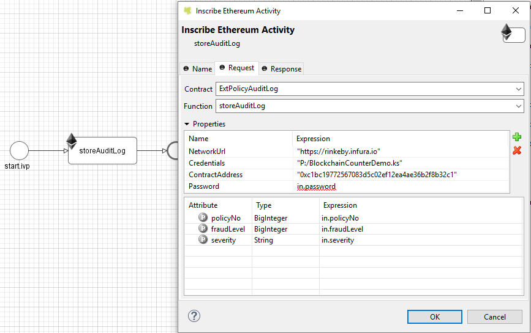

# BPM Beans
A collection of free Axon.ivy process extensions.

## [ETHEREUM](blockchain-beans/README.md)
An Ethereum Blockchain bean to do calls against Ethereum contracts, with input and output mapping.

## [LDAP](ldap-beans/README.MD)
Utility classes to query and modify Active Directory with ivy Program Interface activities.

## [RULE](rule-beans/README.MD)
Decision and Rule step in your process with zero coding effort.

## [TIMED START](timedStartEvent-beans/README.md)
A timed start event bean with weekday, time and interval parameters.
