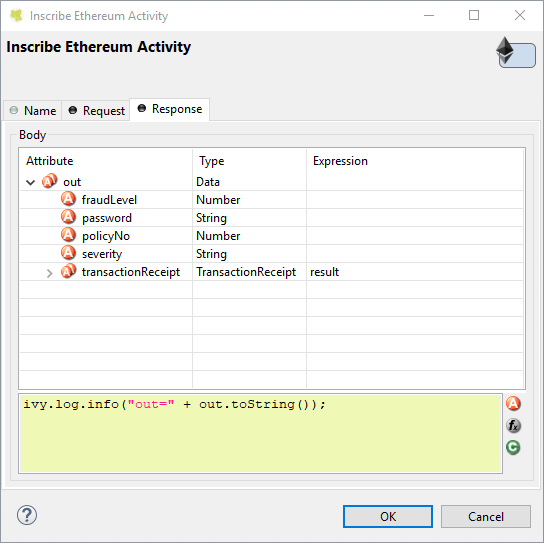

# Ethereum Blockchain Beans
Enables you to do calls into the Ethereum blockchain as a specific activity.

## Ethereum Activity Editor
Simple Ethereum call element.

### Request - Contract
The contract combo box lists all Ethereum contract classes that could be found in the classpath.
Ethereum contract Java classes extend the abstract Web3j class `org.web3j.tx.Contract`.

### Request - Function
The function combo box lists all methods defined by the chosen Ethereum contract class (besides the technical methods `load()` and `deploy()`).
Once a method is chosen the method parameters will be shown in the Attribute table.

### Request - Properties
In order to execute a function of the Ethereum contract, some properties must be set. Property values can be scripted.

The following attributes must be set:
* `Credentials` - The file containing the private key.
* `NetworkUrl` - The Ethereum network URL, e.g. `"https://rinkeby.infura.io"` to connect to the rinkeby test blockchain.
* `Password` - The password to open the `Credentials` file.

The following property is optional:
* `ContractAddress` - The actual blockchain contract address, e.g. `"0xC1bC19772567083d5C02EF12EA4Ae36B2f8b32C1"`.

If no `ContractAddress` is provided, the Ethereum Activity code will deploy the contract on-the-fly.

### Request - Attributes
The `Attributes` table will show the Ethereum method parameters, once a function is chosen.
The values in the Expression column can be scripted.

### Response - Attributes
The `Attributes` table in the `Response` tab shows the output data structure.

The values in the Expression column can be scripted, the method return parameter will always be mapped to the variable `result`.

## Installation
1. Download the latest `supplement.blockchain.beans-X.Y.Z-SNAPSHOT.jar` from the [latest release](https://github.com/ivy-supplements/bpm-beans/releases/latest).
2. Copy the generated JAR into the 'plugins' directory of your Axon.ivy Designer (7.2.0.58791 or later).
3. Open a process and use the additional Ethereum bean provided in the `Blockchain` drawer of Process Editor palette.
