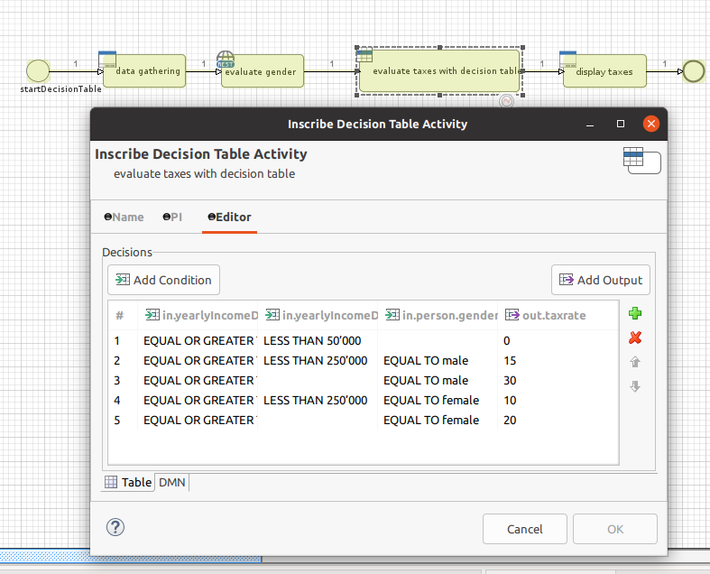
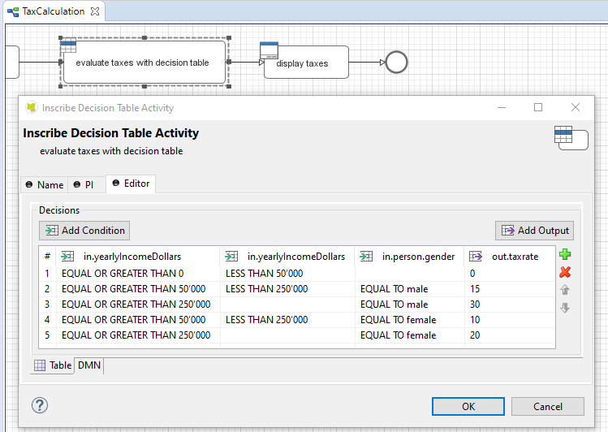
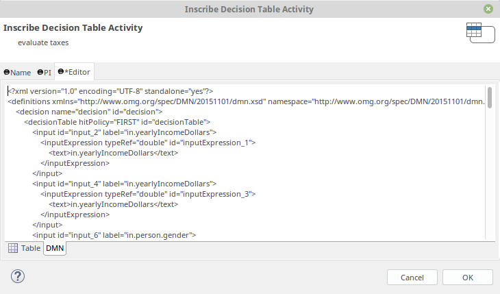

# Decision Table

A DMN (Decision Model and Notation) decision table is a tabular representation used to model business rules and decisions. It defines conditions and corresponding actions or outcomes, enabling automated decision-making based on inputs. With this utility you can integrate DMN tables into your Axon Ivy processes.

This utility:

- links process data to a decision table
- enables convenient condition editing with zero scripting
- supports DMN conformance level 3
- enables standardized XML-export

## Demo

The demo process  gathers data and evaluates the tax rate based on the yearly income and  gender of the person.

### Decision Table Activity
Simple and expressive decision table element. 

### DMN
Exposes the decision in standard [DMN](http://www.omg.org/spec/DMN/) format so that it can be run and edited in any DMN engine.

### Edit
Convenient condition editing with zero scripting

## Setup

Just install the utility from within Axon Ivy designer.
