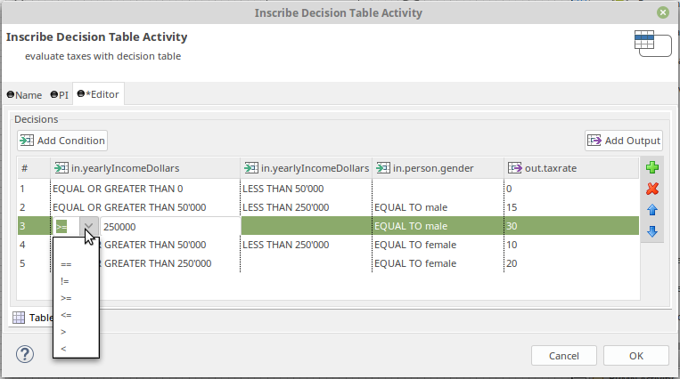

# DMN Tabelle 

Eine DMN (Decision Model and Notation) Entscheidungstabelle ist eine tabellarische Darstellung, mit der du Geschäftsregeln und Entscheidungen modellieren kannst. Sie definiert Bedingungen und die entsprechenden Aktionen oder Ergebnisse, was automatisierte Entscheidungen basierend auf Eingaben ermöglicht. Mit diesem Tool kannst du DMN-Tabellen in deine Axon Ivy Prozesse einbinden.

Dieses Tool:

- verknüpft Prozessdaten mit einer Entscheidungstabelle
- ermöglicht dir das einfache Bearbeiten von Bedingungen, ohne dass du skripten musst
- unterstützt DMN-Konformität Level 3
- ermöglicht standardisierten XML-Export

