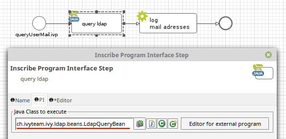
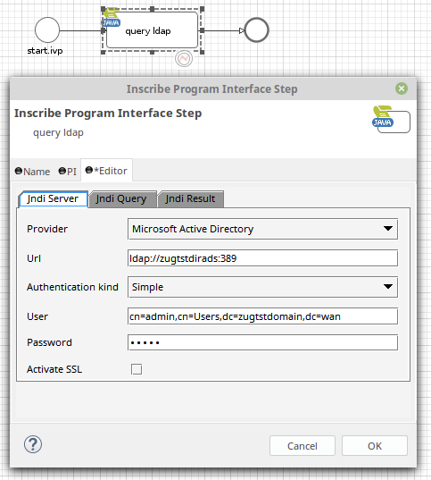
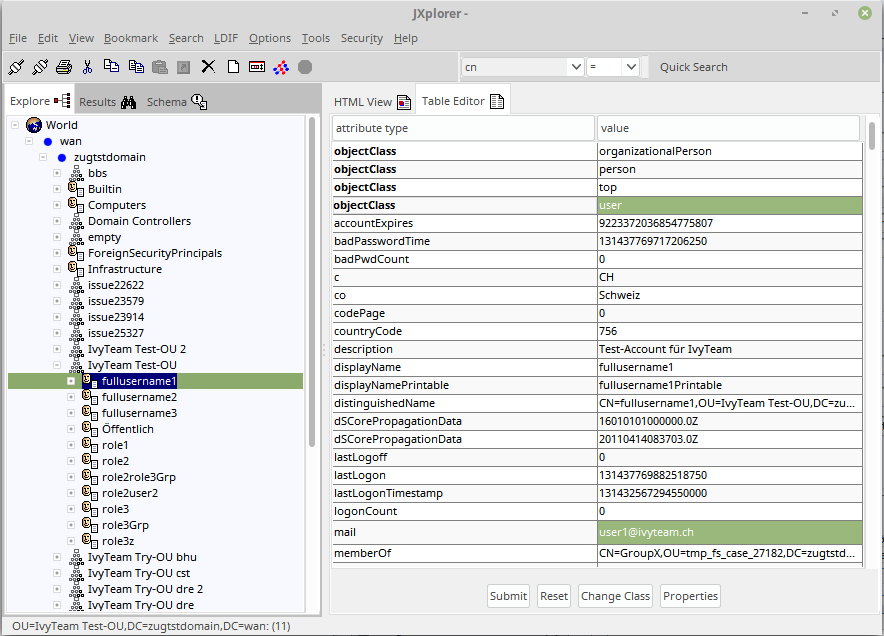

# LDAP Beans
Provides simple Axon.ivy process element extensions that allow to write or query LDAP objects.

## Query Bean
Allows to query LDAP objects. In this example we query all mail adresses of users within our organisation unit.

### Add a Program Element and select the PI class 
`ch.ivyteam.ivy.ldap.beans.LdapQueryBean`

### Define the connection to your LDAP server

### Setup the filter criteria
In this case we filter for users

### Map the data back to process data

### Full example
Rough overview over the LDAP organisation unit. We have three users that own a 'mail' attribute.

We're able to log and display the users mail adresses:

