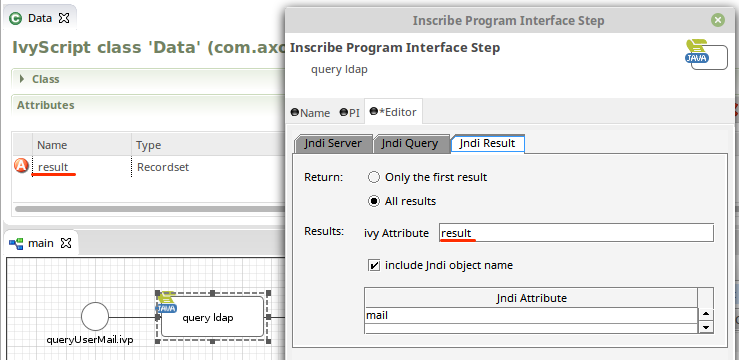
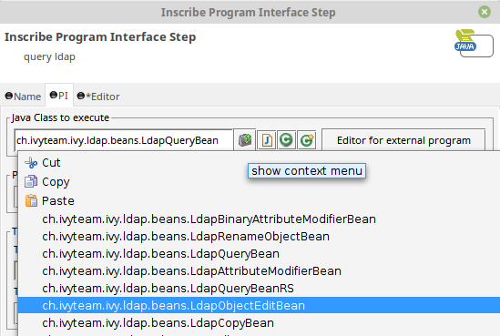

# LDAP Beans
Provides simple Axon Ivy process element extensions that allow to write or query LDAP objects.

## Query Bean
Allows to query LDAP objects. In this example we query all mail adresses of users within our organisation unit.

### Add a Program Element and select the PI class 
`ch.ivyteam.ivy.ldap.beans.LdapQueryBean`

### Define the connection to your LDAP server

### Setup the filter criteria
In this case we filter for users

### Map the data back to process data

### Full example
Rough overview over the LDAP organisation unit. We have three users that own a 'mail' attribute.

We're able to log and display the users mail adresses:

## Installation
1. Download the `supplement.ldap.beans-X.Y.Z-SNAPSHOT.jar` from the [latest release](https://github.com/ivy-supplements/bpm-beans/releases/latest)
2. Copy the downloaded JAR into a directory in our project (e.g. `myProject/lib/supplement.ldap.beans-X.Y.Z-SNAPSHOT.jar`)
3. Add the JAR to the classpath: Switch to the `Java perspective`. Right click on the JAR and select `Build Path` > `Add to Build path`
4. Select and LDAP-bean in the PI tab of `Program Start` element

