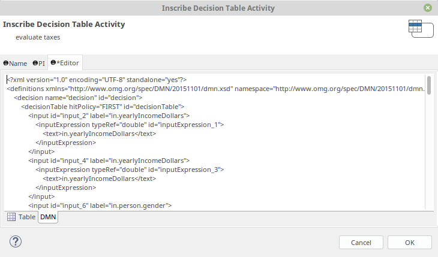
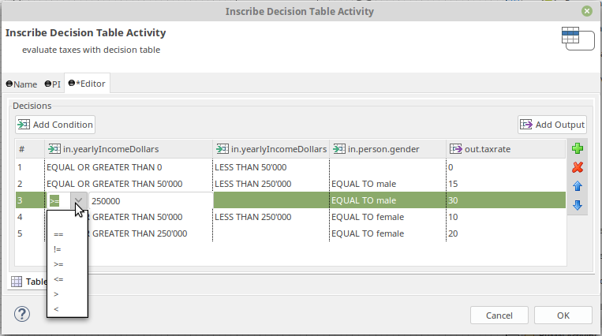

# rule-beans

## Decision Table Activity
Simple and expressive decision table element. 

### DMN
Exposes the decision in standard [DMN](http://www.omg.org/spec/DMN/) format so that it can be run and edited in any DMN engine.

### Edit
Convenient condition editing with zero scripting

