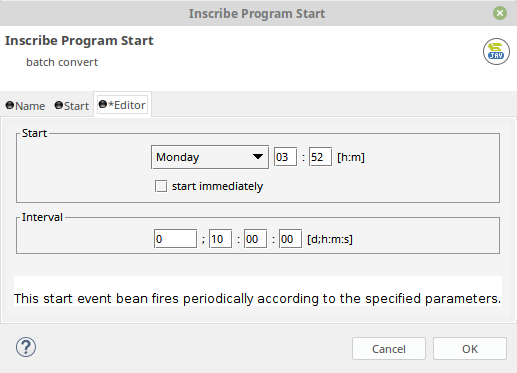
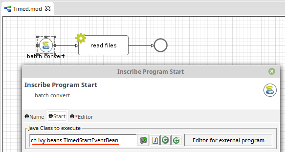

# timed-starteventbean
A timed start event bean with weekday, time and interval parameters

## Installation
1. Download the `supplement.timedStartEvent.beans-X.Y.Z-SNAPSHOT.jar` from the [latest release](https://github.com/ivy-supplements/bpm-beans/releases/latest)
2. Copy the downloaded JAR into a directory in our project (e.g. `myProject/lib/supplement.timedStartEvent.beans-X.Y.Z-SNAPSHOT.jar`)
3. Add the JAR to the classpath: Switch to the `Java perspective`. Right click on the JAR and select `Build Path` > `Add to Build path`
4. Select the `ch.ivy.beans.TimedStartEventBean` in the PI tab of `Program Start` element

